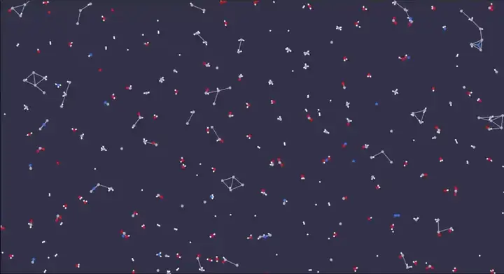
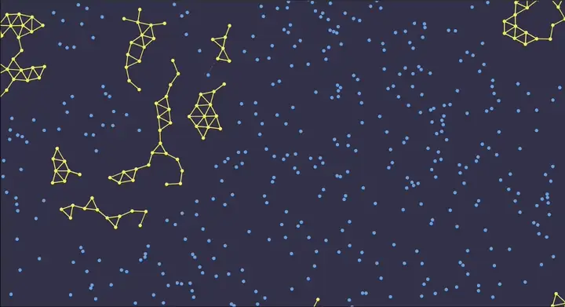

# MolecuLarva — Molecular Simulation

**English** | [Русский](README.ru.md)

This project is an experiment that visualizes the behavior of particles
in 2D and 3D space:

* Collisions and rebounds of particles upon contact.
* Simulation of forces of attraction and repulsion between particles.
* Building connections between particles and the influence of other particles on these connections.
* Transformations of particle types when a connection is created, including merging of two particles into one.
* Spontaneous decay, splitting, or disappearance of particles over time.
* The influence of temperature and other environmental factors on the behavior of particles.

Particles of different types are visualized in different colors. Their properties, presented in the configuration of the world, depend on the type of particle:

1. **Gravity coefficient matrix** shows whether a particle of one type will attract or repel a particle of another type in the case when they are not linked to each other, and with what force.
2. **Link bias matrix** shows whether a particle of one type will attract or repel a particle of another type along the bond in the case when they are already linked to each other, and with what force.
3. **Connection limit map** shows the maximum total number of links for particles of each type.
4. **Connection weight matrix** shows the weight occupied by the link between a particle of type A and a particle of type B in the overall limit on the number of bonds of a particle of type A (in Connection limit map). The maximum number of partners of each type is derived from this weight and the connection limit.
5. **Bond preference matrix** shows which connections a particle prefers. When the connection limit is already reached, a new bond may replace a weaker existing one if its preference is strictly higher.
6. **Link length map** and **link stiffness map** show the preferred length and elastic force of bonds for particles of each type. For a bond between two types these values are averaged.
7. **Tensor of influence on neighbors' bond preference** shows how particles of type A, when linked to B or C, affect the preference of the bond between particles of type B and type C.
8. **Tensor of influence on neighbors' link strength** shows how particles of type A, when linked to B or C, affect the elastic force and the maximum length of the bond between particles of type B and type C.
9. **Transformations** show how a particle of type A changes its type when it creates a connection with a particle of type B, or how A and B merge into a new type on contact.
10. **Decay rules** show how a particle of a given type may change, split, or disappear over time, and which neighboring types stabilize it against decay.

Each type also has its own name, color, radius, mass, and frequency in the initial distribution of particles.

The main goal of this project is to study self-organizing systems and explore configurations in which conditions for
spontaneous emergence of artificial life will be present.

## Demo

[Default types config](https://olegzlobin.github.io/molecular-ts/) (C, H, O, N): particles form bonds and small molecules.

[](https://olegzlobin.github.io/molecular-ts/)

[`catalyst.json`](https://olegzlobin.github.io/molecular-ts/#g1.H4sIAAAAAAAAA5VU227iMBD9l3meRU5asjRvJnGo1cTO2qYtQpHFttBFolAB1aqL-PeV43BZRC_7gIXnHB_PzBlnA78Xy9ljsphPpk8Qb-CWsztbyJRBDOEjIJTXA82TOpRDDKuX5XT-BAjUyMIqmvK-hriNUNB7y4VhiiaGS7GHAkI8mHNxs49GTTCTKmEQk1bQRugpesvNwAdt0c8NL3POlMMjhDup8tQ2JIgJQi15jk1I2Eboyr5I2HlC6OFUn4cDBC6YMpzmJ9BVhKBLxtK66jKngy5NbmwTChA0L8qcZ5yl9qiZk9FsNUYwrCiZoqavTq8MEFKW0IHVZc6Ntrcsl4kvtHWBkEiR8Z4NU2eSz9z9K7iwpdTctRziIUFS-cYeBcM2IegiWauuq4q4od9Y5qG0i-8JAHJLap_-T2-7zuvg0r3NS3wnB5vdRbsE7uX0q6RJcv72MV4f5TmQulYZ4OLzqYBARDC8uKxyGlx0Mww5ehVWFIGjBHAcoIHShQsgU-9FnIuF1PEA3IhXCbpyHAbptQfVhsx_Uoe9jvVbN0HY51cfIN9IKdqCXiCoEMyiZfzd3jPeuTX0kdOr1HceMRs1BEUYO6kqR2lKxjCkm3CM7l0fORM9cu3a2OkhanV1cG55lgjXleOBE0GY0MVI5XV9xk9M_u4Oeqm_66iGjqNCZVAX1vm6AuCWAOHCm1i-lHrTALb9Gs0k-nYzr97de1N-G1fhhMX8cLd8gnr_OZgir9ejndDb9M16uXFFH06Hfnp_H6-X04TAmu09RQY3i91YPioIZxROI18vX8ZGJHzNqez5neHffJZ42_qs83-uP7z8x5h3ydvsXeSww2ykGAAA): type B catalyzes A→B; B decays back to A unless neighboring B stabilize it.

[](https://olegzlobin.github.io/molecular-ts/#g1.H4sIAAAAAAAAA5VU227iMBD9l3meRU5asjRvJnGo1cTO2qYtQpHFttBFolAB1aqL-PeV43BZRC_7gIXnHB_PzBlnA78Xy9ljsphPpk8Qb-CWsztbyJRBDOEjIJTXA82TOpRDDKuX5XT-BAjUyMIqmvK-hriNUNB7y4VhiiaGS7GHAkI8mHNxs49GTTCTKmEQk1bQRugpesvNwAdt0c8NL3POlMMjhDup8tQ2JIgJQi15jk1I2Eboyr5I2HlC6OFUn4cDBC6YMpzmJ9BVhKBLxtK66jKngy5NbmwTChA0L8qcZ5yl9qiZk9FsNUYwrCiZoqavTq8MEFKW0IHVZc6Ntrcsl4kvtHWBkEiR8Z4NU2eSz9z9K7iwpdTctRziIUFS-cYeBcM2IegiWauuq4q4od9Y5qG0i-8JAHJLap_-T2-7zuvg0r3NS3wnB5vdRbsE7uX0q6RJcv72MV4f5TmQulYZ4OLzqYBARDC8uKxyGlx0Mww5ehVWFIGjBHAcoIHShQsgU-9FnIuF1PEA3IhXCbpyHAbptQfVhsx_Uoe9jvVbN0HY51cfIN9IKdqCXiCoEMyiZfzd3jPeuTX0kdOr1HceMRs1BEUYO6kqR2lKxjCkm3CM7l0fORM9cu3a2OkhanV1cG55lgjXleOBE0GY0MVI5XV9xk9M_u4Oeqm_66iGjqNCZVAX1vm6AuCWAOHCm1i-lHrTALb9Gs0k-nYzr97de1N-G1fhhMX8cLd8gnr_OZgir9ejndDb9M16uXFFH06Hfnp_H6-X04TAmu09RQY3i91YPioIZxROI18vX8ZGJHzNqez5neHffJZ42_qs83-uP7z8x5h3ydvsXeSww2ykGAAA)

## Controls
### 3D
* `↑`, `↓`, `←`, `→` — move forward, backward, left, right.
* Rotations are done by dragging.

### 2D
* `Wheel` — move up and down.
* `Shift + Wheel` — move left and right.
* `Ctrl + Wheel` — zoom.
* `Mouse down + Mouse move` — move arbitrarily.
* `Ctrl + Mouse down + Mouse move` (on a particle) — drag it arbitrarily.

### Adding new particles
* `Numeric key down + Click` — add a particle with the type corresponding to the number of the key.
* `1 + click` — add a particle of the first type.
* `2 + click` — add a particle of the second type.
* ...

## Research

Play with the simulation hyperparameters in the [live demo](https://smoren.github.io/molecular-ts/) and share links
to interesting worlds obtained in the app in the [special issue](https://github.com/Smoren/molecular-ts/issues/1).

Worlds can be imported and exported as configuration and state files.

## Install

```bash
npm i
npm run dev
```

## Inspiration

This project was inspired by the [ParticleAutomataJS](https://github.com/artemonigiri/ParticleAutomataJS)
developed by [ArtemOnigiri](https://github.com/artemonigiri).

## Contributing

Contributions are welcome! Feel free to open an issue or submit a pull request on the
[GitHub repository](https://github.com/Smoren/molecular-ts). New UI translations can be added
in `src/web/i18n/locales.ts` and registered in `builtInLocales`.

## License

MolecuLarva is licensed under the MIT License.
